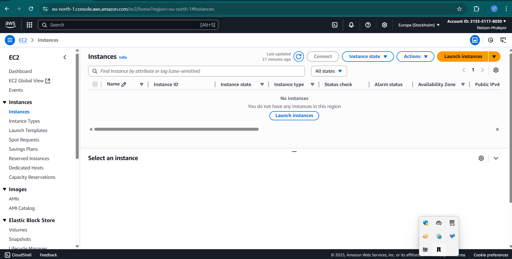
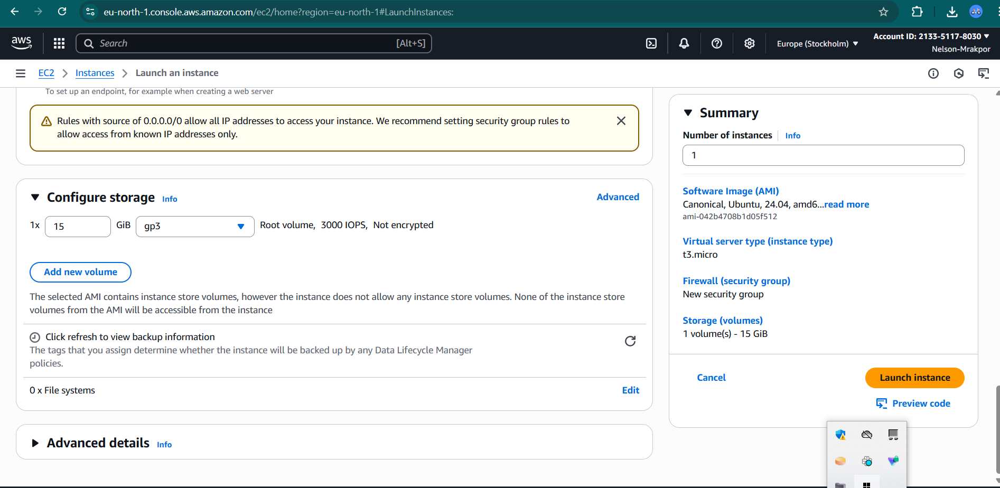
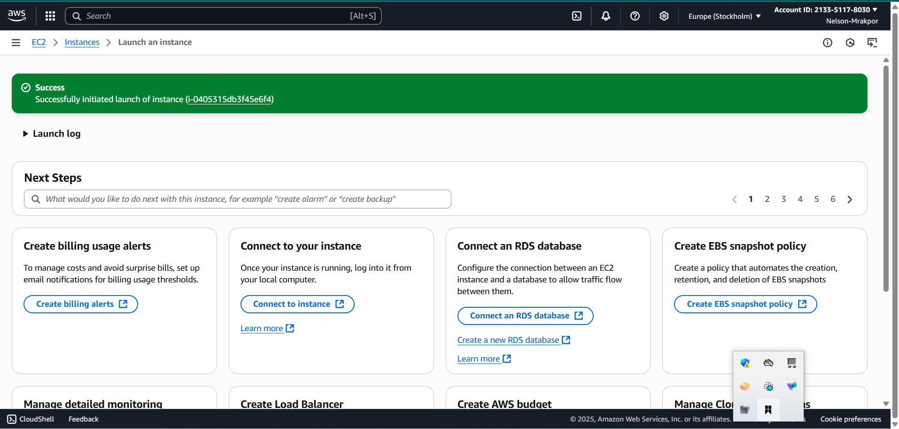
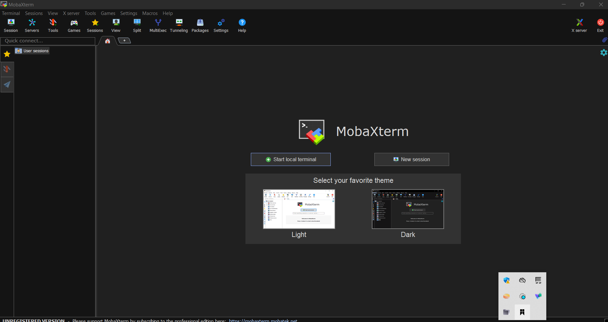
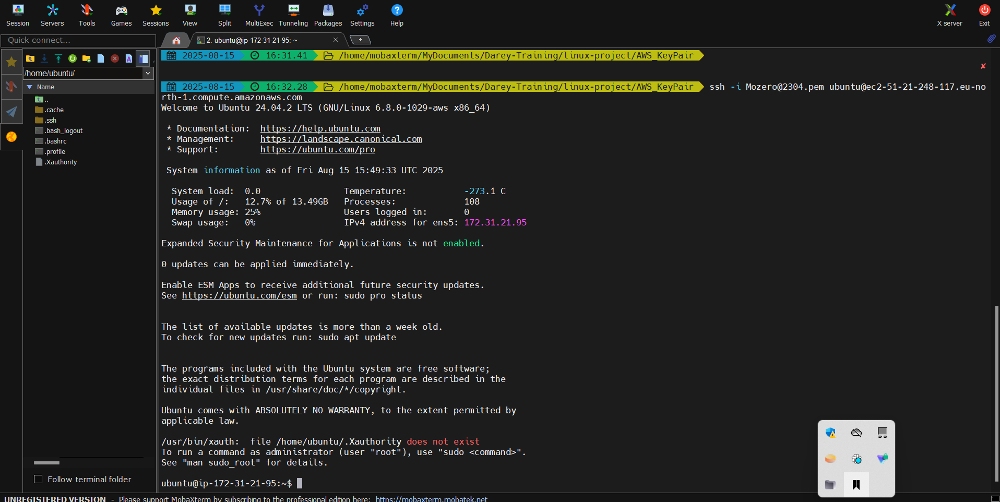
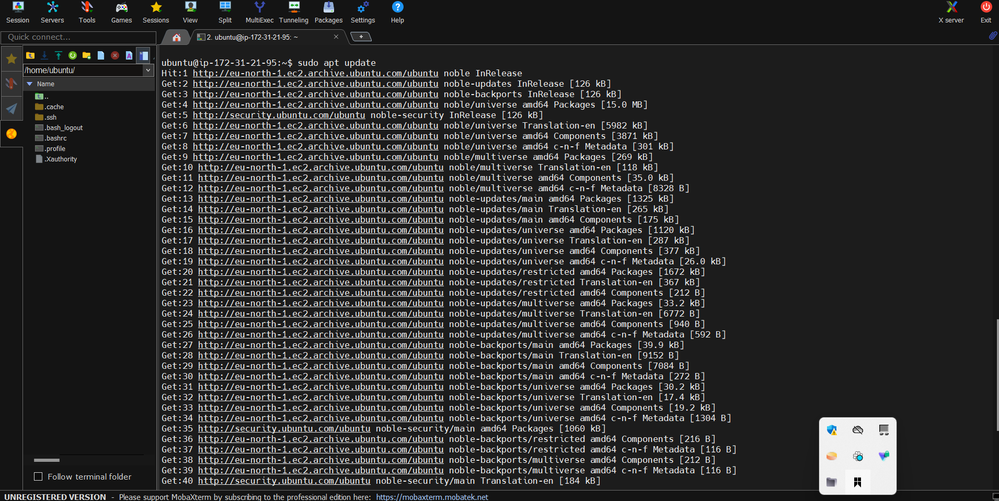
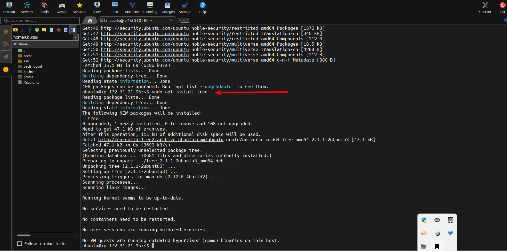
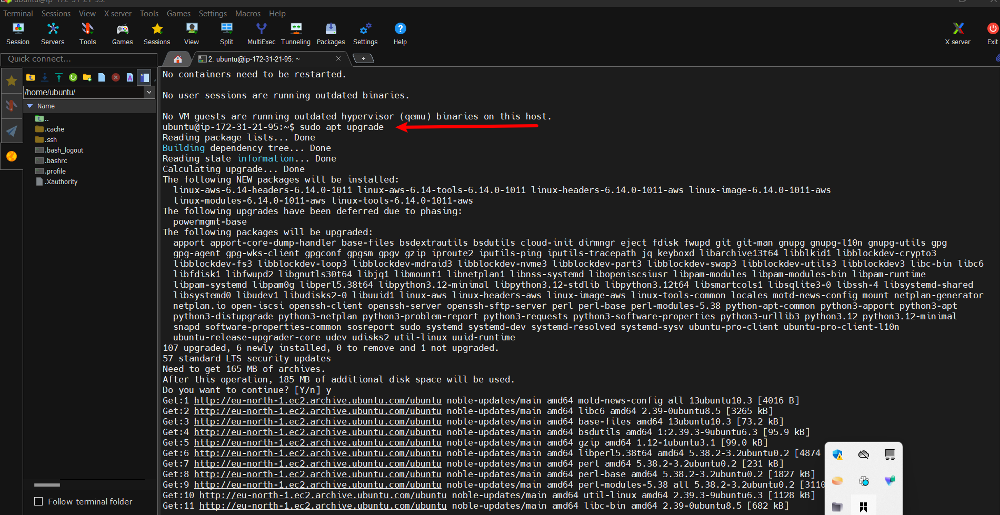
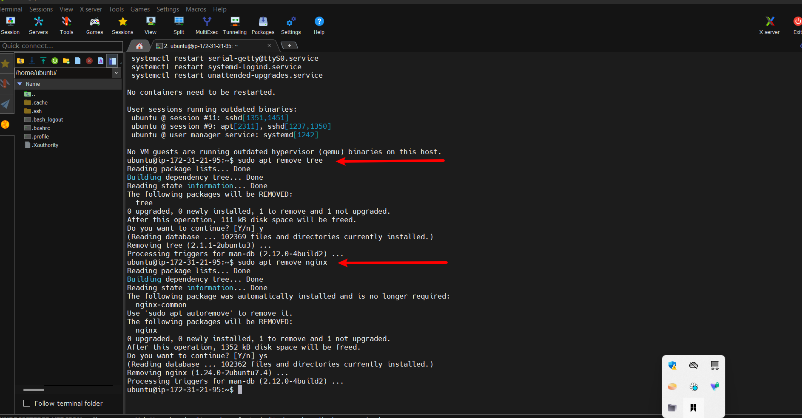

# Linux Fundamentals Project

This project demonstrates foundational Linux skills, including:

- Installing essential packages
- Creating and configuring cloud servers using AWS EC2
- Remotely connecting to cloud servers
- Managing software packages (installing, updating, and removing) from a local environment

---

## 1. Creating an AWS Account and EC2 Instance

I registered a new AWS account at [https://aws.amazon.com/](https://aws.amazon.com/)  
and signed into the AWS Console to create an EC2 instance.



I then configured a virtual cloud server (EC2) with the following parameters:

- **AMI**: Ubuntu 24.04 LTS  
- **Architecture**: 64-bit  
- **Instance Type**: t3.micro  
- **Key Pair**: New key pair created (.pem file)  
- **Storage**: Specified disk size



After the configuration, the EC2 instance was successfully launched.



---

## 2. Installing a Client Tool

To connect to the cloud server from my local machine, I installed **MobaXterm**, a terminal and SSH client.



---

## 3. Connecting to the Cloud Server

Using MobaXterm, I connected to the EC2 instance via SSH.

- The `.pem` key file downloaded during the EC2 setup was used
- Permissions were set using:

```bash
chmod 400 keyname.pem
```

- SSH command used to connect:

```bash
ssh -i "keyname.pem" ubuntu@[public-ip-address]
```



---

## 4. Installing Package Manager and Applications

Once connected to the cloud server, I updated the package manager (`apt`) using:

```bash
sudo apt update
```



After updating, I installed the `tree` package:

```bash
sudo apt install tree
```



---

## 5. Updating Applications

To upgrade installed applications, I ran:

```bash
sudo apt upgrade
```



---

## 6. Removing Unnecessary Packages

To manage limited server resources, I removed unused packages using:

```bash
sudo apt remove [package-name]
```



Finally, the EC2 instance was stopped to avoid unnecessary usage and charges.

---

